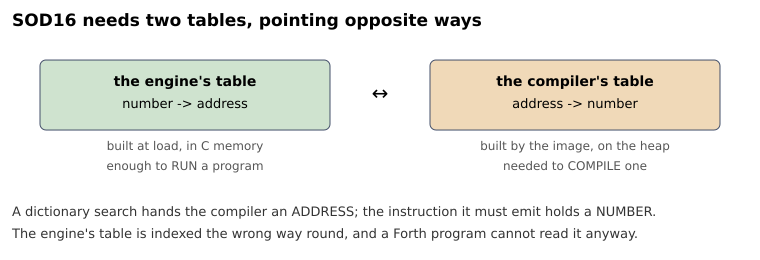
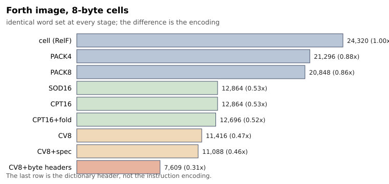

# Как уменьшить виртуальную машину Forth: шесть попыток, две из которых провалились

Здесь измерено, во что на самом деле обходятся шесть способов кодировать
виртуальную машину Forth — на работающих системах, а не в рассуждениях.
Две попытки из шести провалились, и как раз они интереснее всего: одна —
по причине, которую не предсказала бы никакая модель размера, вторую я
отверг когда-то по замеру, оказавшемуся бесполезным. Если вам когда-
нибудь было любопытно, стоит ли упаковывать несколько операций в машинное
слово, — цифра в разделе 2.

Дальше — как я к этому пришёл, в том порядке, в каком это происходило.

Всё, что здесь есть, пересчитывается из репозитория: девять систем, все
проходят один и тот же набор из 616 тестов ANS CORE, и каждая таблица
ниже получена скриптами, названными в конце.


<cut />

В 2004 году, из любопытства, а не по необходимости, я сделал форк SOD32
Л. Бенсхопа — Stack Oriented Design, 32-разрядной виртуальной машины с
Forth поверх неё, — выбросил её упакованный формат команд и заменил его
одним относительным смещением на ячейку. (Ячейка — это машинное слово, на
котором построен Forth: четыре байта на 32-разрядной системе, восемь на
64-разрядной.) Результат я назвал RelF, от Relative Forth. Смысл был в
скорости: пройти по одному смещению — меньше работы, чем распаковать
шесть мелких полей, прежде чем можно будет воспользоваться хоть одним.
Система была только 32-разрядной, работала — и на том осталась. Была ли
она на самом деле быстрее того, из чего выросла, — к этому вопросу
вернётся раздел 8.

Недавно я вернулся к проекту и собрал его под 64 бита. Условия сделки
изменились: тот же Forth, те же слова — в образе, выросшем с 13 380 байт
до 24 320.

Немного терминов. **Шитый код** (threaded code) — это способ, которым
скомпилированное слово записывает, что оно вызывает: список ссылок,
обходимый во время выполнения, а не машинный код. Все схемы ниже
отличаются только тем, как выглядит одна такая ссылка.

Ещё два термина, на которых держатся таблицы. **Движок** — это
C-программа, которая выбирает операции и выполняет их: несколько тысяч
строк, компилируется один раз. **Образ** — это скомпилированная система
Forth, которую движок выполняет: словарь, тела всех слов, весь язык.
Между системами ниже меняется размер только образа. Когда я пишу
«0,47x», речь про образ.

У систем рабочие названия, они используются по всему тексту:

| имя | расшифровка | что это |
|---|---|---|
| SOD32 | Stack Oriented Design, 32-битная | предок: шесть 5-битных подкоманд, упакованных в 32-битную ячейку |
| RelF | Relative Forth | прямой шитый код с относительными адресами: одна ячейка на операцию, вызов хранит расстояние до цели, примитив — свой опкод |
| SOD16 | имя предка, единица вдвое у́же | один 16-битный токен на операцию, вызовы ищутся в таблице |
| CPT16 | Compressed-Pointer Threading, 16 бит | то же, но адрес цели вычисляется, а не ищется |
| CV8 | 8 — ширина единицы в битах; что означало CV, в файлах проекта не сохранилось | та же идея, но потоком байтов |

Все системы собираются, загружаются и проходят один и тот же набор из
616 тестов — слова CORE стандарта ANS Forth. Отношения приводятся к
RelF, то есть меньше — лучше, и каждое несёт одну стандартную ошибку.
Раздел 9 объясняет, как они снимались и почему это важнее, чем кажется.

    tools/build-stages.sh      # все движки и образы, обе ширины ячейки
    tools/run-tests.sh         # корпус на всех
    tools/collect-results.sh   # все таблицы ниже

---

## 1. Что сделал 64-бит

Вот как выглядит кодировка RelF. Это определение:

```forth
: COUNT   DUP 1 + SWAP C@ ;
```

компилируется в семь подряд идущих ячеек — сборка 4-байтовая, — которые
содержат такие значения:

```
   25    9    1   93   29   41    5
  DUP  LIT   1    +   SWAP  C@  EXIT
```

Ячейка хранит либо **вызов** — расстояние от себя до вызываемого
слова, — либо **примитив**, небольшое число, говорящее, какая это
встроенная операция. За некоторыми операциями идёт встроенный операнд:
единица выше — операнд `LIT`.

Младший бит различает эти два случая, и он достаётся бесплатно:
масштабирование индекса примитива на размер ячейки — 4 или 8, обе
степени двойки — оставляет младшие биты пустыми, так что один свободен
под метку. Поэтому `25` — это `1 + 6*4`, где `DUP` имеет индекс 6, на
4-байтовой сборке. На 8-байтовой та же ячейка `DUP` читается как 49.

Ни одного абсолютного адреса в образе нет, поэтому его можно загрузить
куда угодно — ради этого схема и делалась.

Теперь посчитаем байты. Семь ячеек — это 28 байт на 32-разрядной системе
и **56 на 64-разрядной**, для определения, которое не изменилось.
Индексы операций по-прежнему влезают в байт; удвоились ячейки, которые
их держат.

Такова сделка RelF, и она жёсткая: одна ячейка на *операцию*, какой бы
ни была система. По всему ядру это увело образ с 13 380 байт до 24 320
при том же наборе слов — то самое число из вступления и причина всего,
что следует дальше.

Цель дальше — перестать платить дважды за одну и ту же программу просто
потому, что система стала шире, и, поскольку RelF существовал ради
скорости, сделать это, не отдав скорость обратно.

Первая очевидная мысль: это проблема SOD32, и SOD32 её уже решил
упаковкой.

## 2. Попытка первая: упаковать несколько операций в ячейку

Ещё один термин, прежде чем начнутся попытки. **Цикл диспетчеризации** —
та часть движка, которая читает очередную операцию и передаёт управление
на её код. Каждая схема здесь — это свой ответ на вопрос «как одна
операция выглядит в памяти», и за каждую платят именно в этом цикле.

Фокус SOD32 в том, что ячейка содержит шесть операций, а не одну. Ничто
не обязывает ячейку RelF содержать одну. Дальше идут два варианта одной
идеи с разной шириной поля: **PACK4**, с 4-битными опкодами, и
**PACK8**, с 8-битными.

Итак: отвести первый байт ячейки под метку «упаковано» — значение,
которое проверка младшего бита выше никогда не даст, так что обе схемы
уживаются в одном образе, — а остальное заполнить опкодами. Вместо семи
ячеек выше `COUNT` хотелось бы уложить примерно так:

```
  [метка][DUP][LIT][ + ][SWAP][C@ ][EXIT]     одна 8-байтовая ячейка
```

При 8-байтовой ячейке это до семи байтовых опкодов на месте одной
операции (PACK8) или до четырнадцати, если опкод всего четырёхбитный
(PACK4). Четырёхбитное поле достаёт лишь до шестнадцати примитивов, так
что PACK4 получает алфавит из шестнадцати самых частых; всё остальное
остаётся обычной ячейкой.

Обе схемы я оценил раньше в этой же работе и отверг — по синтетическому
тесту, который гонял цикл диспетчеризации по потоку опкодов и сравнивал
время с ячеечной схемой. Он сказал, что упакованные схемы будут работать
в 1,90 и 2,05 раза дольше, то есть на 90% и 105% медленнее на той же
программе. На этом основании я их не строил. В этот раз построил.

Измерено на настоящей работе — каждая система кросс-компилирует ядро
Forth, — на трёх машинах, как отношение времени к ячеечному движку.
Диапазоны в 4-байтовом столбце — разброс между двумя машинами, которые
его собирают.

| | предсказано | ячейка 8 байт | ячейка 4 байта |
|---|---|---|---|
| PACK4, 4-битные опкоды | 2,05x | 1,13 | 1,14–1,18 |
| PACK8, 8-битные опкоды | 1,90x | 1,09 | 1,08–1,18 |

Значит, отвергнуты они были правильно, а вот зафиксированная причина —
нет. Предсказанный штраф 90–105%; измеренный 9–18%. Строго говоря, эти
числа несопоставимы: одно — цикл диспетчеризации в изоляции, другое —
целые программы, где диспетчеризация лишь доля работы. В этом и дело.
Как предсказание того, во что упаковка обойдётся настоящей программе,
число было бесполезно.

Заголовок того самого теста объяснял почему — заранее: его потоки были
подобраны так, чтобы работать «горячими», то есть он мерил стоимость
декодирования при бесплатной памяти, и сам называл это пессимистичным
случаем. Так и было: тест выделял ровно ту стоимость, которую настоящая
работа размывает, а потом изолированное число использовали для
предсказания настоящей работы. База, которой они проиграли, тоже была
неверной: токенный шитый код был записан там как 0,985 — быстрее
ячеечной диспетчеризации — по тесту, гонявшему 32-мегабайтный поток при
2-мегабайтном кэше второго уровня. Он мерил трафик памяти.

Вторая неудача — та, о которой стоит рассказать, и увидеть её можно было
только построив. На бумаге PACK4 и PACK8 вышли вровень, обе по 0,76x:
более узкое поле должно упаковывать вдвое больше операций в ячейку, что
вроде бы компенсирует меньший выбор. Построенные, PACK4 сворачивает
*меньше* ячеек — 377 против 433 — и даёт **более крупный** образ:
21 296 байт против 20 848, при 8-байтовой ячейке.

Причина — в алфавите из шестнадцати опкодов, и всё упирается в то, что
такое *серия*: сколько упаковываемых операций идут подряд, прежде чем их
прервёт неупаковываемая. Именно это решает, окупится ли метка, потому
что каждой непрерывной серии нужна ровно одна.

Примитив вне алфавита не просто не упаковывается. Он **обрывает серию, в
которой стоит**, и обеим половинам нужна своя метка. На реальном коде
ядра средняя длина серии — около 1,3: одна метка ради экономии одного
опкода, то есть никакой экономии.

Значит, упаковке нужны длинные серии упаковываемых операций, а у этого
ядра их нет — оно состоит в основном из вызовов, а вызов в алфавит не
попадает никогда. Верно ли это для Forth вообще, по одной кодовой базе я
сказать не могу, хотя причина не специфична для неё: из вызовов Forth и
состоит.

Подсчёт на бумаге оценил поля и дал 0,76x для обеих. Построенная
программа заплатила ещё и за стыки: 0,876x у PACK4 и 0,857x у PACK8, при
работе на 8–18% медленнее. На этом направление закрылось.

## 3. Попытка вторая: 16-битный токен через таблицу слов

Если ячейка слишком широка — возьмём единицу у́же. Один 16-битный токен
на операцию: значения меньше 256 — примитивы, а 256+n означает «тело
n-го слова», которое ищется в таблице адресов, строимой движком при
загрузке образа. Я назвал это SOD16, по имени предка, чью единицу схема
уполовинивает.

Это стандартное устройство, которое обычно называют **токенным шитым
кодом**: ссылка в скомпилированном слове — не адрес, а номер, и что-то
во время выполнения превращает номер в адрес. Таблица — очевидное «что-
то».

Образ уполовинился, с 24 320 до 12 864 при 8-байтовой ячейке. И на той
нагрузке, по которой эта статья всё меряет, это оказалась худшая система
в наборе:

    SOD16, компиляция ядра   1,378 (AMD, 8 байт)   1,364 (ARM, 4 байта)

Худшая не повсеместно, и исключение интересно. На `parse.fth` — 4000
строк арифметики, набранной в интерпретаторе, — SOD16 идёт на 1,023 там,
где упакованные схемы дают 1,07 и 1,13. Эта нагрузка проводит время
внутри уже транслированных слов ядра, где вдвое меньший образ начинает
окупаться в кэше. Таблица мешает, когда вы *компилируете*, то есть когда
приходится разрешать новые вызовы; когда вы просто выполняете уже
готовое, она стоит гораздо меньше.

На компиляции ядра, впрочем, она отстаёт от ячеечного движка, который
должна была улучшить, на 37%, и никакая другая ступень рядом не стоит.

Обошлась она дороже, чем один поиск в таблице. Таблицы движка хватает,
чтобы *выполнять* программу, и не хватает, чтобы её *компилировать*, и
вся проблема именно в этой асимметрии.



Выполнению нужна первая: токен 256+n, взять запись n, перейти.
Компиляции нужна вторая, потому что поиск по словарю отдаёт компилятору
*адрес*, а команда, которую он обязан выдать, содержит *номер*. Таблица
движка помочь не может: она индексирована не с той стороны и лежит в
собственной памяти движка, которую программа на Forth прочитать не
способна. Поэтому образ строит и поддерживает обращённую копию и делает
по ней двоичный поиск на каждый компилируемый вызов.

И ещё: таблица получает размер при загрузке и не растёт, так что у
слова, определённого позже, номера нет вообще. Понадобился escape-опкод,
несущий полный адрес.

Второй понадобился для `DOES>`. `DOES>` — это то, как в Forth
определяется слово, порождающее другие слова: код после `DOES>`
становится поведением всего, что создаст определяющее слово. Значит,
адрес, на который нужно передать управление, лежит в *середине*
определения, а схема, у которой единственное имя для чего бы то ни было
— «слово номер n», такого сказать не умеет.

Конкретно: скомпилировать один вызов в SOD16 — это взять адрес цели;
пройти по собственной копии списка слов (wordlist) образа и найти, какое слово с
него начинается; двоичным поиском превратить это в номер; а если слово
определено после загрузки — сдаться и выдать escape-форму. Сравните с
версией CPT16 в следующем разделе: одна строка на Forth.

## 4. Попытка третья: удалить таблицу

Если проблема в таблице — вычислим адрес вместо того, чтобы его искать.
Разложим слова так, чтобы цель была `база + (значение << сдвиг)` — та же
идея «база плюс масштабированный индекс», которую HotSpot использует для
ссылок на объекты, и причина, по которой эта схема называется CPT16,
compressed-pointer threading, 16-битная единица. Таблицы адресов слов
нет, значит нет и второй зависимой загрузки по пути к вызову, а работа
компилятора умещается в строку:

```forth
: CALL, ( a-addr --- )
  START @ - CPT-SHIFT RSHIFT 256 + OP, ;
```

Вычесть базу образа из цели, сдвинуть вниз и прибавить 256, потому что
токены ниже — примитивы. Ни поиска, ни второй таблицы.

    CPT16, компиляция ядра   1,035 ±0,033 (AMD, ячейка 8 байт)
                             1,024 ±0,021 (AMD, 4 байта)
                             1,007 ±0,016 (ARM, 4 байта)

Вровень с ячеечным движком — при том же размере образа, что у SOD16:
12 864 байта, байт в байт. Ядро не задействует ни один из escape-ов
SOD16: все вызовы в нём — к словам, существовавшим на момент загрузки, а
единственный `DOES>` обслуживается собственным опкодом в обеих схемах.
Так что оба образа кодируют одни и те же операции той же шириной и
отличаются только тем, что означает токен вызова.

Измеряется здесь сумма, и стоит быть точным, какая именно. CPT16 убирает
сразу две вещи: поиск в таблице внутри цикла диспетчеризации и поиск
компилятора от адреса обратно к номеру слова. Разрыв между SOD16 и CPT16
— 0,343 при 8-байтовой ячейке и 0,348 при 4-байтовой: около 34%. Это
измеренная стоимость табличной конструкции SOD16 на компиляции ядра, а
не стоимость одного поиска. Как эти 34% делятся между поиском в цикле
диспетчеризации и обращённой картой компилятора, я не мерил.

Что сумма всё же показывает: сама по себе 16-битная единица не проблема.
SOD16 и CPT16 используют одну и ту же ширину, и одна из них идёт вровень
с ячеечным движком. Дорогой оказалась бухгалтерия — а выглядела она
бесплатной косвенностью.

## 5. Попытка четвёртая: сузить саму единицу

Два урока указывают в одну сторону. Упаковка не работает, потому что у
кода нет длинных серий. Логика в диспетчере не работает, потому что
стоит ровно столько, на сколько выглядит. Остаётся один рычаг — размер
самой единицы: не сколько операций делят ячейку и не насколько хитро
вычисляется цель, а сколько байт занимает одна операция.

Итак: поток байтов. Он называется CV8, а не «CPT8», потому что шаг здесь
не только в более узкой единице: CPT16 — схема фиксированной ширины,
каждая операция это один токен, а адрес цели в байт не влезает. CV8 от
этого отказывается и становится первой схемой здесь, у которой операции
не одного размера.

Один байт — одна операция, если эта операция примитив. Значения меньше
0x80 — это 128 примитивов.

Вызов в байт не помещается, и он не пытается. Байт 0x80 или больше
означает «это вызов», а следующий бит говорит, какой он длины: ещё один
байт после него, что даёт 14-битное смещение, или ещё два, что даёт 22
бита.

Для цикла диспетчеризации это сравнение и сдвиг, без метки и без всякой
зависимости от серий.

Бюджет здесь важен, и он оказывается тесным. Из 128 значений ниже 0x80:
68 — примитивы ядра, ещё пять — формы литералов и слов данных, 23 —
свёрнутые пары из раздела 6, и 24 — его специализированные опкоды.
Наибольшее использованное значение — 119, свободными остаются восемь.
Это достаточно близко к пределу, чтобы добавление ещё одного семейства
специализаций означало выбор, что выбросить.

Одно не изменилось, и дальше это важно: команды теперь размером в байт,
но их цели по-прежнему стоят на старой ячеечной сетке. Смещение, которое
несёт вызов, масштабировано — оно считает ячейки от базы образа, а не
байты, — поэтому вызов по-прежнему может назвать лишь каждый восьмой
адрес, а тела по-прежнему добиваются так, чтобы попадать на него. Раздел
7 — о том, как это убрать.

    CV8, компиляция ядра   0,919 ±0,026 (AMD, ячейка 8 байт)
                           0,896 ±0,011 (ARM, 4 байта)
    CV8, образ             11 416 байт при 8-байтовой ячейке,
                           0,469x от ячеечной схемы

Первая схема в последовательности, которая обошла ячеечный движок сразу
по обеим осям. Вот снова `COUNT`, определение из раздела 1, во всех трёх
кодировках, вынутое из настоящих образов при 4-байтовой ячейке скриптом
`tools/show-word.sh`:

```
: COUNT   DUP 1 + SWAP C@ ;

ячейка   25 9 1 93 29 41 5      7 ячеек x 4  = 28 байт
токен    6 2 1 23 7 10 1        7 токенов x 2 = 14 байт
CV8      6 120 1 7 79                           5 байт
```

Строка «токен» — это те же семь операций, что и строка «ячейка», с теми
же индексами, вдвое компактнее. Строка CV8 занимает пять байт, потому
что две пары операций свернулись в один опкод каждая. `120` — опкод
«прибавить непосредственный операнд», в который свернулось «положить 1 и
сложить», а `79` — один опкод, означающий «`C@`, затем выход».

## 6. Попытка пятая: дать частым случаям свои опкоды

Пять байт на шесть операций в той строке CV8 — это два разных приёма,
работающих одновременно. Они делались вместе и описаны здесь вместе.

**Свёртка**: примитив, за которым сразу идёт `EXIT`, становится одним
опкодом, что убирает один проход по циклу диспетчеризации из конца очень
многих определений.

**Специализация**: дать частому случаю собственный опкод. Это старый
байт-кодовый приём — Smalltalk-80 тратит байткоды с 16 по 31 на «положи
временную переменную n», Lua носит малые операнды внутри команды, — а не
адаптивная специализация CPython 3.11, которая переписывает опкоды во
время выполнения по наблюдаемым типам. Здесь всё решается на этапе
компиляции.



| ступень | компиляция ядра (AMD, 8 байт) | образ | от ячейки |
|---|---|---|---|
| ячейка | 1,000 ±0,037 | 24 320 | 1,000 |
| CPT16 | 1,035 ±0,033 | 12 864 | 0,529 |
| CPT16 + свёртка | 0,897 ±0,027 | 12 696 | 0,522 |
| CV8 | 0,919 ±0,026 | 11 416 | 0,469 |
| CV8 + специализация | 0,688 ±0,019 | 11 088 | 0,456 |

Одна строка в этой таблице идёт не туда, и замазывать это не следует:
CV8 *медленнее* свёрнутого CPT16, 0,919 против 0,897. Этот разрыв меньше
доверительного интервала любой из двух цифр, так что сам по себе он был
бы ничем, — но знак у него одинаков во всех измеренных столбцах: +0,022
при 8-байтовой ячейке на AMD, +0,019 при 4-байтовой, +0,016 на ARM. Три
независимых измерения, согласные в направлении, весят больше, чем одно,
согласное само с собой.

Сужение единицы до байта не даётся даром: вызов перестаёт быть одним
фиксированным токеном и становится двумя байтами, которые надо собрать.
Взамен получаем 10% образа. Это размен, и последовательность оправдана
только строкой ниже.

Специализированные опкоды — более крупный шаг на x86, причём заметно.
Разделим лестницу надвое — ячеечная схема до CV8, затем CV8 до CV8 с
опкодами — и вычтем:

| | ячейка -> CV8 | CV8 -> +спец |
|---|---|---|
| AMD, 8 байт | 0,081 | 0,231 |
| AMD, 4 байта | 0,062 | 0,264 |
| ARMv7, 4 байта | 0,104 | 0,107 |

В три-четыре раза на x86. На ARM оба шага выходят одного размера в
пределах своих интервалов — ±0,011 и ±0,008 на задействованных
ступенях, — так что там они неразличимы, а не упорядочены. Оба шага
помогают на обеих машинах; насколько один больше другого — не
переносится, и по одной машине я бы этого не узнал.

Это к тому же последовательные разности вдоль одного пути, а не
ранжирование приёмов. Я никогда не пробовал специализировать CPT16 или
добавлять опкоды до сужения единицы, так что не могу сказать, чего та же
работа стоила бы в другом порядке. Некоторые из этих опкодов существуют
только потому, что в байтовом потоке нашлось однобайтовое место, куда их
положить.

Не все пять специализаций оправдывают себя; учёт — в разделе 10.

## 7. Попытка шестая: последнее место, где ещё платили за ширину ячейки

К этому моменту поток токенов одинаков при обеих ширинах ячейки — одна и
та же программа. Но 64-разрядный образ был всё ещё на 2980 байт больше
32-разрядного. Измерено, это оказались: 1088 байт ячеек поля связи, 496
— добивки для выравнивания имён, 660 — добивки для выравнивания конца
каждого тела кода, остальное — данные.

Ничего из этого не код. Это *заголовок* словаря, которого вся работа над
кодировками ни разу не коснулась.

Поэтому поле связи стало расстоянием, от 1 до 3 байт, с меткой в
последнем байте — чтобы оно декодировалось при чтении назад от имени так
же, как вызов декодируется при чтении вперёд. Имена перестали добиваться,
тела кода перестали добиваться, а вызовы получили возможность называть
любой байт, а не каждый восьмой.

    образ, ячейка 8 байт    11 088 -> 7 609     0,456x -> 0,313x
    образ, ячейка 4 байта    8 108 -> 6 749     0,606x -> 0,504x

Крупнейший единичный результат по размеру во всей последовательности — и
пришёл он из словаря, а не из кодировки команд.

Оставшиеся 860 байт разницы между двумя ширинами раскладываются так:

    408   поля данных — ячейки, потому что VARIABLE хранит ячейку
    273   семнадцать встроенных операндов, всё ещё размером в ячейку,
          плюс добивка, которую они навязывают окружающим телам
    156   таблица списка слов (wordlist)
     23   стартовый пролог и сами поля связи

Гоняться стоит только за 273 — и стоит сказать, что это за семнадцать
операндов, потому что именно это делает их интересными. Это управляющие
конструкции и их родня: пять смещений `(DO)`/`(LOOP)` и двенадцать
исполнительных токенов от `[']` и `POSTPONE`. С самими переходами всё в
порядке: условный переход в CPT16 или CV8 несёт знаковое 16-битное
смещение от операнда, и ни одно определение в этом ядре к пределу даже
не приближается. Ячеечными остались именно операнды цикла и токены,
потому что рантайм цикла читает свой одной выровненной выборкой, а
побайтовый вариант положил бы работу по декодированию во внутренний цикл
каждого `DO`.

Даром это тоже не даётся, и стоимость ложится туда, куда и должна по
конструкции, — на поиск в словаре, потому что цепочку из переменной
длины обходить дороже, чем из ячеек. Всё при 4-байтовой ячейке, которую
собирают обе машины:

| нагрузка | AMD | ARMv7 |
|---|---|---|
| компиляция ядра | +0,056 | +0,046 |
| корпус | +0,086 | +0,085 |
| разбор | +0,119 | +0,101 |

При 8-байтовой ячейке на машине AMD стоимость на компиляции ядра
составляет +0,039. Воспроизведено на трёх отдельных сборках на машине
AMD и на двух на плате ARM; цифра по корпусу повторяется до тысячной.
Это оптимизация размера, которая стоит времени, на обеих архитектурах, и
тот, кто станет её применять, должен понимать, что именно из двух он
покупает.

Так что последовательность заканчивается разменом, а не победой: 0,31x
образа, 0,73 времени на компиляции ядра и измеримо более медленный
словарь.

## 8. Предпосылка, которую я не проверил

Различие, которое до сих пор подразумевалось, здесь становится сутью
дела. У Forth есть **внутренний интерпретатор** — цикл диспетчеризации,
выполняющий скомпилированные слова, — и **внешний интерпретатор**, тот,
что читает текст, ищет каждое слово в словаре и либо выполняет его, либо
компилирует. Всё выше — про внутренний.

Оставалось одно, и это та часть работы, повторения которой я больше
всего хотел бы избавить других.

RelF существовал, чтобы быть быстрее SOD32, — ради этого и делался
форк, — и в конце я запустил их рядом, чего не делал никогда: ни в 2004
году, ни разу за всю работу выше.

SOD32 оказался вдвое быстрее RelF на тестовом корпусе и в 2,9 раза
быстрее на интерпретации текста.

Причина не в виртуальной машине, и увидеть это надо не измерением, а
подсчётом. На одном и том же входе SOD32 выполняет 44,5 миллиона
операций ВМ, а RelF — 266,6 миллиона: вшестеро больше работы при том же
результате, причём с более быстрой диспетчеризацией из двух. Это
счётчики. Они одинаковы на любой машине, и ни смещение раскладки, ни
шумный сосед их не трогают.

Заодно это определяет, чего данная работа *не* установила. RelF делался
ради ускорения внутреннего интерпретатора. Нагрузки, которые могли бы
это проверить — счётный цикл и рекурсивное число Фибоначчи, — как раз те
две, что проект отбросил как невоспроизводимые. По имеющимся здесь
свидетельствам утверждение 2004 года не подтверждено и не опровергнуто.
Оно по-прежнему не проверено.

Причина заняла полдня. Словарь SOD32 — это 32 хешированные цепочки,
выбираемые по первым двум символам имени. У RelF была одна цепочка,
обходимая сверху вниз. Хеш я потерял, меняя поля связи с абсолютных на
относительные в 2004-м, и не вернулся посмотреть, во что это обошлось.
Дороже всего это обходится *числам*, которые в словаре не находятся
никогда и потому оплачивают полный обход, прежде чем интерпретатор
сдастся и преобразует их, — а в `parse.fth`, то есть в 4000 строках
интерпретируемой арифметики, числами является примерно половина лексем.
Обычный исходник не столь крайний случай, но каждое число в нём платит
тот же полный обход.

После восстановления, с неизменной хеш-функцией SOD32:

    просмотрено словарных статей     было   8 052 823
                                    стало     288 037
                                    SOD32     397 720

Это счётчики, поэтому они одинаковы на любой машине. Во времени это дало
2,7x на разборе при 4-байтовой ячейке и 3,5x при 8-байтовой — измерено
до того, как появилось усреднение по сборкам из раздела 9, то есть это
одиночные сборки, что при таком размере эффекта роли не играет, но
сказать стоит.

Сравним сопоставимое: на разборе вся последовательность кодировок из
этой статьи стоит 0,80. Одно упущение, будучи исправленным, стоило от
двух с половиной до трёх с половиной раз.

Хеширование словаря — не озарение, и в SOD32 оно уже было, так что
интересна здесь не починка. Интересно, почему никто не заметил: каждый
тест в этом проекте сравнивал систему с ней же самой — с предыдущей
ступенью, со сборкой прошлой недели, — и ни разу с тем, из чего она была
форкнута, чтобы это обойти. Дефект появился в 2004-м и пролежал
нетронутым до этого года, а предок всё это время лежал в архиве.

Это значит ещё и вот что: всё выше настраивало систему, которая всё это
время несла четырёхкратный гандикап в текстовом интерпретаторе. Все
отношения в этой статье измерены после исправления.

Если у вашего проекта есть родитель — возьмите и запустите родителя.

## 9. Как это измерялось

Всё собиралось и проверялось на трёх машинах — одноядерной x86-64
виртуальной машине, 16-ядерном ноутбуке x86-64 и четырёхъядерной плате
ARMv7, — но приводятся здесь только две. ВМ — это контейнер, в котором
делалась работа; она слишком шумная, чтобы что-то разрешать, и её цифр в
`results/` нет. Каждое число в этой статье — с ноутбука или с платы.

Основная нагрузка — каждая система **кросс-компилирует ядро Forth**:
читает исходник ядра на Forth и выписывает свежий образ, самая крупная
настоящая работа из всех, какие они делают. Она задействует сразу
текстовый интерпретатор, компилятор и словарь, и она не может дать
преимущество кодировке тем, что производит, потому что образ все системы
пишут один и тот же, в ячеечном формате, — различается код, который
пишет.

Она же служит проверкой правильности. Полученный образ обязан побайтово
совпасть с эталонным, прежде чем будет записано хоть одно время, так что
правильность и скорость выходят из одного запуска, и система, которая
быстра потому, что тихо неправа, не проходит то самое сравнение, которое
её измеряет.

Шесть систем выдают собственную кодировку, компилируя новые определения
во время работы. Две оставшиеся получаются трансляцией готового
ячеечного образа через `tools/layout.py` — поэтому они умеют выполнять
всё, что есть в образе, и при этом компилировать в ячейках.

Три вещи о том, как снимались числа.

**Разброс — от сборки к сборке.** Повторные запуски одних и тех же
двоичных файлов сходятся в пределах 1–2%. Пересоберите дерево — и
ступень сдвинется на пять или десять процентов, потому что то, куда
компилятор кладёт код, стоит столько же и для данного двоичного файла
зафиксировано. Взятие минимума по большему числу повторов измеряет это
смещение точнее, а не устраняет его. Поэтому каждый движок собирается
пятью способами флагами, которые только двигают код, все пять
измеряются, и в таблицу идёт среднее со стандартной ошибкой. Самый
широкий разброс из всех ступеней оказался у *базовой* — у числа, на
которое делится каждое отношение в каждой таблице: 12,6%.

**Тихая машина измерила лучше быстрой.** Порог разрешения
16-ядерного ноутбука показал 5,3% в одном прогоне и 13,1% в следующем;
плата ARM, четыре медленных ядра, на которых больше ничего не
запущено, разрешает около 1%.

**Две нагрузки пришлось выбросить.** Микротест со счётным циклом гулял
на 21% между запусками одного и того же двоичного файла на одной машине;
рекурсивное число Фибоначчи — на 15–23%. Обе — короткие и узкие. Обе
выжившие нагрузки прогоняют много разнообразного кода. Тесный цикл
интерпретатора на горсти опкодов определяется предсказанием косвенных
переходов и раскладкой кода, то есть ровно тем, что меняется между
сборками, — значит, измеряет он сборку.

Каждый вывод выше пережил измерение дважды на обеих машинах.

## 10. Что не измерено

- Две машины — не исследование. Один ноутбук x86-64 и одна плата ARMv7;
  ничего с другим порядком байтов и ничего без операционной системы
  снизу.
- Чистое исполнение здесь надёжно не измеряется ничем: оба микротеста не
  прошли по воспроизводимости.
- Не все пять специализаций оправдывают себя. По тому, сколько экономит
  каждая в отдельности: малые целые — 190 байт, горячие слова ядра —
  194, непосредственные операнды — 111. Они перекрываются, так что в
  сумме не дают тех 328, на которые сдвинулся образ. Остальные две хуже.
  Локальные переменные инертны — `locals.4` загружается только в образ
  оболочки, так что у ядра, которое гоняют все тесты, специализировать
  нечего, — а специализация переменных делает образ на 18 байт
  *больше* без измеримого выигрыша по времени. Обе оставлены
  включёнными, чтобы публикуемые цифры соответствовали тому, что
  собирает репозиторий.

### Чего лишает токенный шитый код

Последнее ограничение — самое крупное, и оно прямое следствие того, что
сделало образ маленьким.

В ячеечном Forth первое поле слова указывает на код, который его
выполняет, поэтому программа может изобрести новый *вид* слова — новое
поведение, а не просто новое определение, — написав новое поле кода. На
этом держится несколько классических приёмов Forth.

В SOD16 и CPT16 вызов называет слово, а в CV8 — адрес, с которого
какое-то слово начинается. Ни то, ни другое не умеет назвать поведение.
`DOES>` уцелел только потому, что ему дали собственный опкод, и он
остался единственной точкой расширения: новый тип поведения больше
нельзя добавить из Forth, только из C. Это самая сильная архитектурная
претензия, какую эта схема получала, и ответа у меня нет.

## 11. Что вышло

Начало и конец, тот же Forth, те же 616 тестов пройдены:

| | образ | компиляция ядра | разбор |
|---|---|---|---|
| RelF, откуда всё началось | 24 320 байт | 1,000 | 1,000 |
| CV8 + специализация + байтовые заголовки | 7 609 байт | 0,731 | 0,799 |

Одно свойство пережило всю последовательность нетронутым: любой образ
здесь по-прежнему позиционно-независим. CPT16 и CV8 оба вычисляют адрес
цели от базы образа, так что образ по-прежнему грузится по любому
адресу — ради чего RelF и появился.

Все три столбца при 8-байтовой ячейке: 0,31x образа и 0,73 времени на
самой крупной работе компилятора, ценой 20% на интерпретации текста. При
4-байтовой ячейке, с которой RelF начинал, та же последовательность даёт
0,50x образа, 0,73 на компиляции ядра и 0,83 на разборе.

Если сопоставить с разделом 8: хеш-таблица на разборе стоила больше, чем
вся эта последовательность. Это не делает последовательность
бессмысленной, и причину стоит назвать, потому что это тот вопрос,
который концовка напрашивается задать. Эти два результата независимы.
Хеш живёт в текстовом интерпретаторе и размера образа не касается, так
что весь результат по размеру остаётся в силе; а каждое отношение
скорости здесь измерено уже с хешем на месте. Сравнение говорит о
приоритетах, а не о впустую потраченной работе.

Семь вещей, которые я сказал бы тому, кто начинает такую же работу.

**Схеме упаковки с метками нужны длинные серии упаковываемых операций, а
у этого ядра их нет.** Средняя длина серии здесь около 1,3, так что
метка не успевает окупиться. Я ожидал бы этого от Forth вообще, раз
вызовы рвут серии, а Forth состоит из вызовов, — но одно ядро это не
язык.

**Использовать ячейку интенсивнее не получилось; отказаться от неё как
от единицы кодирования — получилось.** Ценой стали команды переменной
длины, а это реальное усложнение декодера, и здесь оно окупилось.

**Таблица навязывает затраты за пределами цикла диспетчеризации.**
Удаление таблицы номеров слов и той бухгалтерии, которую она навязывала
компилятору, стоило 34% на двоих. Что из двух весило больше, я не мерил.

**Спрашивайте пораньше, нельзя ли дать частым случаям собственные
опкоды.** На измеренном здесь пути их добавление улучшило компиляцию
ядра в три-четыре раза сильнее, чем предшествовавший переход от ячейки к
CV8 на x86, и примерно настолько же на ARM. В другом порядке я их не
пробовал, так что это сравнение двух шагов в одной последовательности.

**Смотрите за пределы потока команд.** Заголовок словаря, которого не
коснулась вся работа над кодировками, дал крупнейший единичный результат
по размеру во всей последовательности.

**Если раскладка кода влияет на ваш тест — учитывайте разброс между
сборками.** Здесь пересборка сдвигала результат на пять-десять
процентов, и повторением запуска этого не увидеть. Самый широкий разброс
оказался у базовой ступени, на которую делится каждое отношение.

**Запустите родителя.** Если ваш проект от чего-то форкнут — меряйтесь с
этим чем-то. Это единственная проверка здесь, нашедшая проблему крупнее
всего, ради чего проект затевался.

## Ссылки

- Brad Rodriguez, *Moving Forth*, часть 1 —
  <https://www.bradrodriguez.com/papers/moving1.htm>
- R.G. Loeliger, *Threaded Interpretive Languages*, Byte Books, 1981
- L.C. Benschop, SOD32 — <https://github.com/lennart-benschop/sod32>,
  включён в репозиторий на зафиксированной ревизии, GPLv2
- Обсуждение ForthHub #187, «An elevator description for Forth's
  threaded code models?», чьей терминологией пользуется эта статья —
  <https://github.com/ForthHub/discussion/discussions/187>
- IEEE 1275-1994, стандарт Open Firmware, чей FCode — байт-кодированный
  Forth: однобайтовые коды `0x10`–`0xFE`, escape-полоса `0x01`–`0x0F`
  для двухбайтовых. CV8 взял идею байтового потока с escape, но не
  раскладку — он разделяет по старшему биту и имеет один escape-опкод.
  Различаются они и тем, что называют: токен FCode *сам по себе* есть
  ссылка на словарь, тогда как вызов CV8 несёт смещение до места.
- Заимствовано и отмечено в исходниках там, где заимствовано: сжатые
  указатели на объекты из HotSpot — для `база + (v << сдвиг)`;
  CPython 3.11 (PEP 659, специализирующий интерпретатор), который
  адаптивен там, где специализация этого проекта статична; Lua 5.4 —
  непосредственные операнды; `iload` из виртуальной машины Java,
  `LOAD_FAST` из CPython и байткоды 16–31 из Smalltalk-80 — локальные
  переменные как опкоды; интерпретатор Wasm «на месте» Титцера —
  интерпретировать компактную форму, а не разворачивать её при загрузке.
